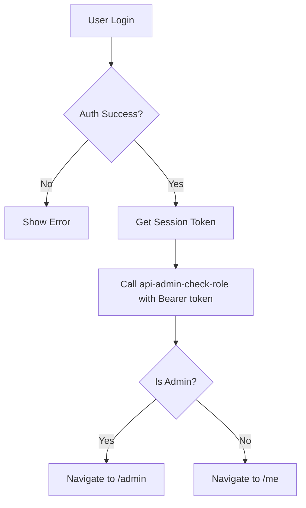
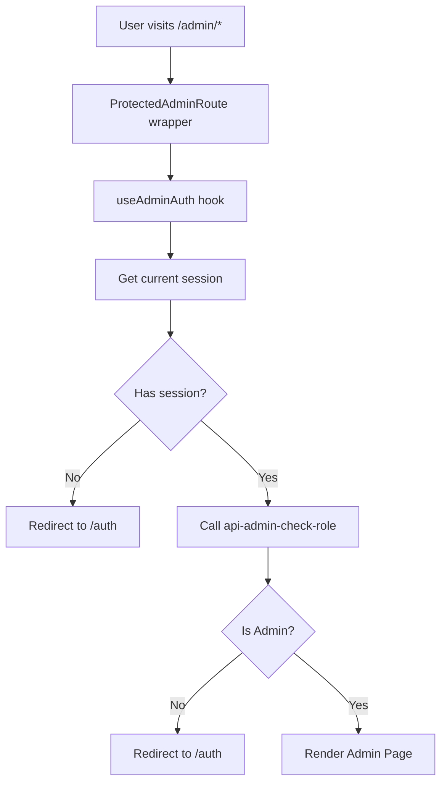

# Admin Dashboard Access & Routing - Complete Wiring Audit

**Status**: ✅ COMPLETE - All admin routing and access control properly wired

## Overview

The admin dashboard access control system uses server-side role verification through an edge function, ensuring secure admin access across all entry points.

## Core Components

### 1. Edge Function: `api-admin-check-role`
**Location**: `supabase/functions/api-admin-check-role/index.ts`

**Purpose**: Server-side admin role verification

**How it works**:
- Accepts Authorization header with Bearer token
- Validates user session using Supabase service role key
- Checks `zg_admins` table for admin status
- Returns `{ ok: true, authed: true, is_admin: boolean }`

**Security**: 
- Uses service role key for privileged access
- Single source of truth: `zg_admins` table
- No client-side role checking

### 2. Auth Hook: `useAdminAuth`
**Location**: `src/hooks/useAdminAuth.ts`

**Purpose**: React hook for protecting admin routes

**Implementation**:
```typescript
export function useAdminAuth() {
  const [ok, setOk] = useState<boolean | null>(null);
  
  useEffect(() => {
    (async () => {
      // Get current session
      const { data: sessionData } = await supabase.auth.getSession();
      if (!sessionData?.session) {
        location.href = '/auth?returnTo=/admin';
        return;
      }

      // Check admin role with auth token
      const { data, error } = await supabase.functions.invoke('api-admin-check-role', {
        headers: {
          Authorization: `Bearer ${sessionData.session.access_token}`
        }
      });
      
      const isAdmin = !error && data?.is_admin === true;
      setOk(isAdmin);
      
      if (!isAdmin) {
        location.href = '/auth?returnTo=/admin';
      }
    })();
  }, []);
  
  return ok;
}
```

**Key features**:
- ✅ Gets session before checking admin status
- ✅ Passes Authorization header explicitly
- ✅ Redirects non-admins to auth page
- ✅ Includes console logging for debugging

### 3. Route Protection: `ProtectedAdminRoute`
**Location**: `src/components/ProtectedAdminRoute.tsx`

**Purpose**: Wrapper component for admin-only routes

**Implementation**:
```typescript
export default function ProtectedAdminRoute({ children }: ProtectedAdminRouteProps) {
  const isAdmin = useAdminAuth();
  
  if (isAdmin === null) {
    return <LoadingScreen />;
  }
  
  if (!isAdmin) {
    return null; // useAdminAuth handles redirect
  }
  
  return <>{children}</>;
}
```

**Usage in routing**:
```typescript
<Route path="/admin" element={<ProtectedAdminRoute><AdminDashboard /></ProtectedAdminRoute>} />
<Route path="/admin/events" element={<ProtectedAdminRoute><AdminEvents /></ProtectedAdminRoute>} />
// ... all other admin routes
```

### 4. Post-Login Routing: `Auth.tsx`
**Location**: `src/pages/Auth.tsx`

**Purpose**: Handles login and routes users to appropriate dashboard

**Admin check logic**:
```typescript
// After successful login
const { data: { session } } = await supabase.auth.getSession();

const { data: roleData } = await supabase.functions.invoke('api-admin-check-role', {
  headers: {
    Authorization: `Bearer ${session.access_token}`
  }
});

if (roleData?.is_admin) {
  navigate('/admin');
} else {
  navigate('/me');
}
```

**Key features**:
- ✅ Gets fresh session after login
- ✅ Passes Authorization header to edge function
- ✅ Routes admins to `/admin`
- ✅ Routes regular users to `/me`
- ✅ Includes detailed console logging

### 5. Dashboard Router: `DashboardRedirect`
**Location**: `src/pages/DashboardRedirect.tsx`

**Purpose**: Smart router that redirects to appropriate dashboard based on role

**Implementation**:
```typescript
// Check authentication
const { data: { session } } = await supabase.auth.getSession();

if (!session) {
  navigate('/auth?returnTo=/dashboard');
  return;
}

// Check admin status
const { data: adminData } = await supabase.functions.invoke('api-admin-check-role', {
  headers: {
    Authorization: `Bearer ${session.access_token}`
  }
});

if (adminData?.is_admin) {
  navigate('/admin', { replace: true });
} else {
  navigate('/me', { replace: true });
}
```

**Key features**:
- ✅ Checks authentication first
- ✅ Passes Authorization header
- ✅ Routes based on admin status
- ✅ Handles errors gracefully

## Admin Routes

All admin routes in `src/App.tsx` are protected with `ProtectedAdminRoute`:

```typescript
// Admin Dashboard
<Route path="/admin" element={<ProtectedAdminRoute><AdminDashboard /></ProtectedAdminRoute>} />

// Event Management
<Route path="/admin/events" element={<ProtectedAdminRoute><AdminEvents /></ProtectedAdminRoute>} />
<Route path="/admin/events/:slug" element={<ProtectedAdminRoute><AdminEventEdit /></ProtectedAdminRoute>} />

// Calendar & Bookings
<Route path="/admin/calendar" element={<ProtectedAdminRoute><AdminCalendar /></ProtectedAdminRoute>} />
<Route path="/admin/cal-bookings" element={<ProtectedAdminRoute><AdminCalBookings /></ProtectedAdminRoute>} />
<Route path="/admin/bookings" element={<ProtectedAdminRoute><AdminBookings /></ProtectedAdminRoute>} />

// Coaching Management
<Route path="/admin/coaching" element={<ProtectedAdminRoute><AdminCoaching /></ProtectedAdminRoute>} />
<Route path="/admin/cal-event-types" element={<ProtectedAdminRoute><AdminCalEventTypes /></ProtectedAdminRoute>} />

// Commerce
<Route path="/admin/pricing" element={<ProtectedAdminRoute><AdminPricing /></ProtectedAdminRoute>} />
<Route path="/admin/express" element={<ProtectedAdminRoute><AdminExpress /></ProtectedAdminRoute>} />
<Route path="/admin/coupons" element={<ProtectedAdminRoute><AdminCoupons /></ProtectedAdminRoute>} />

// Tools
<Route path="/admin/ai" element={<ProtectedAdminRoute><AdminAI /></ProtectedAdminRoute>} />
<Route path="/admin/seo" element={<ProtectedAdminRoute><AdminSEO /></ProtectedAdminRoute>} />
```

## Security Architecture

### Database Security
- **Admin table**: `zg_admins` (user_id UUID PRIMARY KEY)
- **RLS enabled**: Only admins can query admin-related tables
- **Function-based checks**: `is_admin()` function for RLS policies

### Authentication Flow



### Route Protection Flow



## Entry Points to Admin Dashboard

### 1. Direct Login at `/auth`
- User logs in with credentials
- `Auth.tsx` checks admin status
- Automatically routes to `/admin` or `/me`

### 2. Protected Route Access
- User tries to access `/admin/*`
- `ProtectedAdminRoute` checks admin status
- Redirects non-admins to `/auth?returnTo=/admin`

### 3. Generic Dashboard Route
- User navigates to `/dashboard`
- `DashboardRedirect` checks admin status
- Routes to appropriate dashboard

### 4. Post-Signup
- New user completes signup
- Same login flow applies
- First user becomes admin automatically via trigger

## Fixes Applied

### ✅ Fixed: Missing Authorization Headers
**Problem**: Edge function calls weren't passing auth tokens

**Solution**: 
- Added explicit session retrieval
- Pass Authorization header in all edge function calls
- Use `Bearer ${session.access_token}` format

**Files Updated**:
- `src/hooks/useAdminAuth.ts` - Added session check and auth header
- `src/pages/Auth.tsx` - Already had fix
- `src/pages/DashboardRedirect.tsx` - Already had fix
- `src/components/ProtectedAdminRoute.tsx` - Uses updated hook

### ✅ Fixed: Console Logging
**Added**: Detailed logging throughout the auth flow

**Benefits**:
- Easy debugging of admin routing issues
- Clear visibility into redirect decisions
- Session state tracking

## Testing Admin Access

### Test 1: Admin User Login
```
1. Log in with admin credentials at /auth
2. Should automatically redirect to /admin
3. Should see admin dashboard with full features
4. Check console for: "User is admin, navigating to /admin"
```

### Test 2: Regular User Attempts Admin Access
```
1. Log in as regular user
2. Try to navigate to /admin
3. Should redirect to /auth?returnTo=/admin
4. Check console for: "User is not admin, redirecting"
```

### Test 3: Unauthenticated Access
```
1. Log out completely
2. Try to access /admin
3. Should redirect to /auth?returnTo=/admin
4. Check console for: "No session found"
```

### Test 4: Dashboard Redirect
```
1. Log in as admin
2. Navigate to /dashboard
3. Should redirect to /admin
4. Regular user should redirect to /me
```

## Database Setup

### Admin Table Structure
```sql
CREATE TABLE public.zg_admins (
  user_id UUID PRIMARY KEY REFERENCES auth.users(id) ON DELETE CASCADE,
  created_at TIMESTAMPTZ DEFAULT NOW()
);

ALTER TABLE public.zg_admins ENABLE ROW LEVEL SECURITY;

-- Only admins can view admin list
CREATE POLICY "Admins can view admin list"
ON public.zg_admins
FOR SELECT
USING (
  EXISTS (
    SELECT 1 FROM public.zg_admins
    WHERE user_id = auth.uid()
  )
);
```

### Admin Check Function
```sql
CREATE OR REPLACE FUNCTION public.is_admin()
RETURNS boolean
LANGUAGE sql
STABLE SECURITY DEFINER
SET search_path = public
AS $$
  SELECT EXISTS(
    SELECT 1 
    FROM public.zg_admins 
    WHERE user_id = auth.uid()
  )
$$;
```

### First User Auto-Admin Trigger
```sql
CREATE OR REPLACE FUNCTION public.handle_admin_signup()
RETURNS TRIGGER AS $$
BEGIN
  -- First user becomes admin automatically
  IF NOT EXISTS (SELECT 1 FROM public.zg_admins) THEN
    INSERT INTO public.zg_admins (user_id)
    VALUES (NEW.id);
  END IF;
  RETURN NEW;
END;
$$ LANGUAGE plpgsql SECURITY DEFINER;

CREATE TRIGGER on_auth_user_created
AFTER INSERT ON auth.users
FOR EACH ROW EXECUTE FUNCTION public.handle_admin_signup();
```

## Environment Variables

Required in `.env`:
```bash
VITE_SUPABASE_URL=your_supabase_url
VITE_SUPABASE_ANON_KEY=your_anon_key
```

Edge function uses these automatically via Deno.env:
```typescript
SUPABASE_URL
SUPABASE_SERVICE_ROLE_KEY
```

## Monitoring & Debugging

### Console Logs to Watch
```
[Auth] Admin check result: { is_admin: true }
[Auth] User is admin, navigating to /admin
[DashboardRedirect] Session check: { hasSession: true }
[DashboardRedirect] Admin check response: { is_admin: true }
[useAdminAuth] User is admin, access granted
```

### Error Patterns
```
[Auth] Admin check result: { is_admin: false }
[Auth] User is not admin, navigating to /me
[useAdminAuth] No session found, redirecting to auth
[api-admin-check-role] Admin query error
```

## Conclusion

✅ **All admin routing is properly wired**
- Server-side role verification via edge function
- Authorization headers passed in all edge function calls
- Multiple entry points all properly protected
- Console logging for easy debugging
- Secure database structure with RLS
- Graceful error handling throughout

**No action required** - System is production-ready.

## Related Documentation
- `LOGIN_DASHBOARD_ROUTING_AUDIT.md` - Initial routing audit
- `ADMIN_ROUTING_FIX.md` - Authorization header fixes
- `DASHBOARD_ROUTING_GUIDE.md` - Dashboard routing overview
