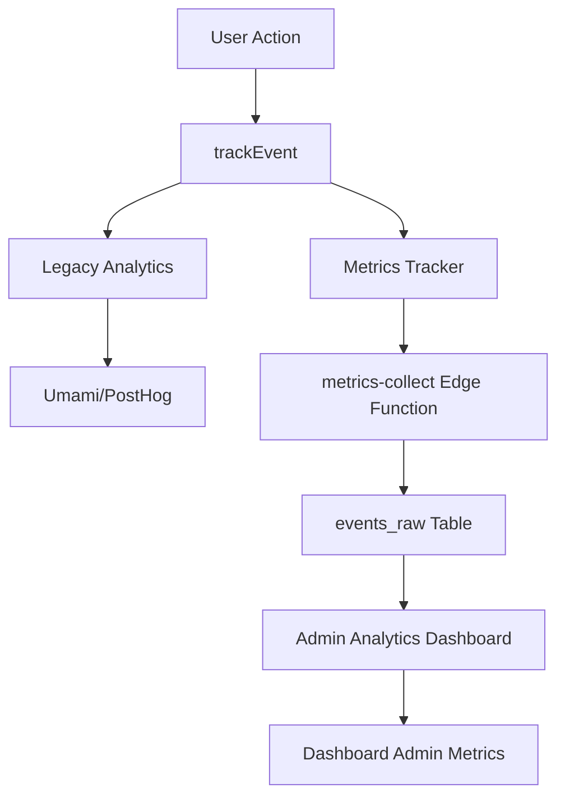

# Analytics Flow Documentation

## Overview
This document describes the complete analytics architecture connecting the main site, PWA, and admin dashboard.

---

## 📊 Analytics Systems

### 1. **Legacy Analytics** (Umami + PostHog)
- **Location**: `src/lib/initAnalytics.ts`, `src/lib/analytics.ts`
- **Initialization**: Auto-initialized in `App.tsx` on mount
- **Tracking**: Page views, user identification, custom events
- **Region**: Global build only (disabled for China build)

### 2. **Metrics Tracker** (Custom Analytics)
- **Location**: `src/lib/metricsTracker.ts`
- **Backend**: `supabase/functions/metrics-collect/index.ts`
- **Database**: `events_raw` table
- **Features**:
  - Auto-tracking page views on route changes
  - UTM parameter capture
  - Device type detection
  - Session tracking with unique IDs
  - Batched event collection (50 events or 5 seconds)
  - Privacy-respecting (honors Do Not Track)

### 3. **Telemetry System** (Backend Events)
- **Location**: `src/lib/telemetry.ts`, `src/lib/pwa/telemetry.ts`
- **Backend**: `supabase/functions/api-telemetry-log/index.ts`
- **Database**: `analytics_events` table
- **Use**: Backend-specific tracking for PWA and API events

### 4. **Unified Tracking Interface**
- **Location**: `src/lib/trackEvent.ts`
- **Purpose**: Single API that tracks across all systems
- **Usage**: `trackEvent('event_name', { properties })`

---

## 🔄 Data Flow



---

## 📍 Tracking Implementation

### Main Site Pages

#### **Home** (`src/pages/Home.tsx`)
- ✅ `home_page_view` - Tracks page view with language

#### **Pricing** (`src/pages/Pricing.tsx`)
- ✅ `pricing_page_view` - Page view with language
- ✅ `checkout_started` - When user initiates checkout with plan details

#### **Contact** (`src/pages/Contact.tsx`)
- ✅ `contact_form_submitted` - Form submission with topic/channel/language

#### **Coaching Programs** (`src/pages/CoachingPrograms.tsx`)
- ✅ `coaching_programs_view` - Page view with language

#### **Book Session** (`src/pages/BookSession.tsx`)
- ✅ `book_view` - Initial page view (legacy)
- ✅ `booking_page_view` - Page view (new)
- ✅ `book_start` - Form submission (legacy)
- ✅ `booking_form_submitted` - Form submission with timeline/language

#### **Events List** (`src/pages/EventsList.tsx`)
- ✅ `events_list_view` - Page view

#### **Blog** (`src/pages/BlogDetail.tsx`, `src/pages/BlogList.tsx`)
- ✅ `blog_read` - Blog post click
- ✅ `cta_click` - CTA clicks with location

#### **Quiz** (`src/pages/Quiz.tsx`)
- ✅ `lm_submit` - Lead magnet submission
- ✅ `quiz_complete` - Quiz completion with score

#### **Pricing Success** (`src/pages/PricingSuccess.tsx`)
- ✅ `checkout_complete` - Successful plan purchase

### Admin Pages

#### **Admin Overview** (`src/pages/admin/Overview.tsx`)
- ✅ `admin_overview_view` - Dashboard view

#### **Admin Analytics** (`src/pages/admin/Analytics.tsx`)
- ✅ `admin_analytics_view` - Analytics page view

---

## 🗄️ Database Schema

### `events_raw` Table
Stores all metrics tracker events:
```sql
CREATE TABLE events_raw (
  id BIGSERIAL PRIMARY KEY,
  ts TIMESTAMPTZ NOT NULL,
  session_id TEXT NOT NULL,
  user_hash TEXT,
  event TEXT NOT NULL,
  route TEXT,
  referrer TEXT,
  utm_source TEXT,
  utm_medium TEXT,
  utm_campaign TEXT,
  utm_content TEXT,
  utm_term TEXT,
  device TEXT,
  lang TEXT,
  country TEXT,
  meta JSONB
);
```

### `analytics_events` Table
Stores telemetry system events:
```sql
CREATE TABLE analytics_events (
  id UUID PRIMARY KEY DEFAULT gen_random_uuid(),
  event_name TEXT NOT NULL,
  properties JSONB,
  created_at TIMESTAMPTZ DEFAULT NOW()
);
```

---

## 🔌 Edge Functions

### **metrics-collect** (`supabase/functions/metrics-collect/index.ts`)
- **Purpose**: Collects batched event data from metricsTracker
- **Verification**: JWT not required (public endpoint)
- **Security**: IP hashing for privacy, respects Do Not Track
- **Rate Limit**: Max 100 events per request

### **api-telemetry-log** (`supabase/functions/api-telemetry-log/index.ts`)
- **Purpose**: Logs backend telemetry events
- **Verification**: JWT not required
- **Storage**: `analytics_events` table

### **dashboard-admin-metrics** (`supabase/functions/dashboard-admin-metrics/index.ts`)
- **Purpose**: Aggregates metrics for admin dashboard
- **Verification**: JWT required + admin role check
- **Returns**: KPIs, funnel data, top content, alerts

---

## 📈 Admin Dashboard Integration

### Data Sources
The admin analytics dashboard pulls from multiple sources:

1. **`events_raw`** - User behavior events
2. **`analytics_events`** - Backend telemetry
3. **`zg_receipts`** - Payment tracking
4. **`lesson_progress`** - Content engagement
5. **`me_sessions`** - Booking data
6. **`leads`** - Contact form submissions

### Key Metrics Displayed

#### Overview Page (`/admin`)
- MRR (Monthly Recurring Revenue)
- Active Subscriptions
- DAU (Daily Active Users)
- MAU (Monthly Active Users)
- Lesson Completions (30d)
- Bookings (30d)
- New Leads (30d)
- Conversion Rate
- Conversion Funnel
- Top Content

#### Analytics Page (`/admin/analytics`)
- Detailed metrics breakdown
- Platform performance
- Content leaderboard
- Real-time KPI tracking

---

## 🔐 Security & Privacy

### Privacy Protections
- ✅ Do Not Track respected
- ✅ IP addresses hashed (SHA-256 + salt)
- ✅ Session IDs stored in sessionStorage only
- ✅ No PII collected without consent
- ✅ CORS headers properly configured

### Admin Access Control
- ✅ JWT verification on admin endpoints
- ✅ Role-based access via `requireAdmin()` helper
- ✅ Server-side validation of admin status

---

## 🚀 Usage Guide

### For Developers

#### Track a custom event:
```typescript
import { trackEvent } from '@/lib/trackEvent';

trackEvent('button_clicked', {
  button: 'signup',
  location: 'hero'
});
```

#### Track page view (automatic):
Page views are automatically tracked by `metricsTracker` on route changes.

#### Use convenience methods:
```typescript
import { tracking } from '@/lib/trackEvent';

tracking.ctaClick('Get Started', 'hero');
tracking.bookingStarted();
tracking.quizCompleted(85);
```

### For Admins

1. Navigate to `/admin/analytics` for detailed metrics
2. View real-time KPIs on `/admin` dashboard
3. Data refreshes every 60 seconds automatically
4. Click "Refresh" button for manual update

---

## 🧪 Testing Analytics

### Check if tracking is working:

1. **Console Logs** (Development):
   ```
   [Metrics] Tracked 5 events
   [Analytics] page_view {...}
   ```

2. **Database Verification**:
   ```sql
   SELECT * FROM events_raw 
   ORDER BY ts DESC 
   LIMIT 10;
   ```

3. **Admin Dashboard**:
   - Navigate to `/admin/analytics`
   - Check DAU/MAU counters
   - Verify events appear in real-time

---

## 📋 Event Catalog

### Core Events
- `page_view` - Auto-tracked on route change
- `home_page_view` - Home page specific
- `pricing_page_view` - Pricing page
- `coaching_programs_view` - Coaching list
- `events_list_view` - Events list
- `booking_page_view` - Booking page

### Conversion Events
- `checkout_started` - User initiates checkout
- `checkout_complete` - Successful purchase
- `contact_form_submitted` - Contact form
- `booking_form_submitted` - Booking form
- `quiz_complete` - Quiz submission

### Admin Events
- `admin_overview_view` - Admin dashboard
- `admin_analytics_view` - Admin analytics page

### Content Events
- `blog_read` - Blog post viewed
- `cta_click` - CTA button clicked

---

## 🛠️ Maintenance

### Adding New Tracking

1. Import trackEvent:
   ```typescript
   import { trackEvent } from '@/lib/trackEvent';
   ```

2. Add useEffect to component:
   ```typescript
   useEffect(() => {
     trackEvent('event_name', { property: 'value' });
   }, []);
   ```

3. Test in development console
4. Verify in admin dashboard

### Debugging

If events aren't appearing:

1. Check browser console for errors
2. Verify Do Not Track is disabled
3. Check `events_raw` table directly
4. Ensure edge functions are deployed
5. Check admin session is valid

---

## 🎯 Best Practices

1. **Always include context**: Add relevant properties to events
2. **Use semantic names**: Make event names descriptive
3. **Batch related events**: Use convenience methods when possible
4. **Test thoroughly**: Verify tracking in dev before deploy
5. **Respect privacy**: Honor user preferences and DNT
6. **Monitor performance**: Keep event payloads small

---

## 📞 Support

For analytics issues:
1. Check console logs for errors
2. Verify edge functions are deployed
3. Review database permissions
4. Check admin role assignment
5. Contact development team

---

**Last Updated**: 2025-01-11  
**Version**: 1.0.0
