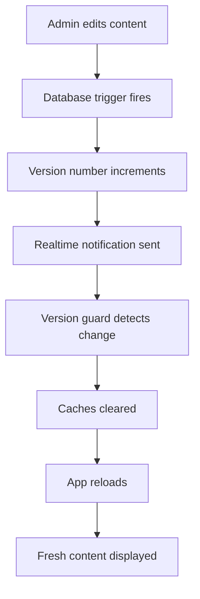

# Content Version Control & Cache Invalidation System

## Overview

ZhenGrowth now includes an automatic content versioning system that ensures all users see the latest content immediately when changes are made. The system monitors database changes and automatically invalidates caches across all clients.

## Architecture

### 1. Database Layer (`zg_versions` table)

- **Single source of truth** for content version tracking
- Monotonically increasing version number
- Triggers automatically bump version when content changes

### 2. Monitored Tables

The system automatically bumps the version when changes occur in:

- `coaching_offers` - Coaching program offers
- `coaching_pages` - Coaching program landing pages
- `blog_posts` - Blog content
- `events` - Event listings
- `event_tickets` - Event ticket configurations
- `remote_flags` - Feature flags
- `i18n_translations` - Translations
- `cal_event_types` - Cal.com event types

### 3. API Endpoints

#### `/api/version`
- Returns current content version
- No authentication required
- No caching (always fresh)

#### `/api/admin/bump-version` (Admin only)
- Manually bump version to force global cache refresh
- Requires admin authentication

### 4. Client-Side Version Guard

**Location**: `src/lib/versionGuard.ts`

**Features**:
- **Realtime monitoring** - Instant updates via Supabase realtime subscriptions
- **Polling fallback** - Checks every 60 seconds as backup
- **Automatic cache invalidation** - Clears all caches when version changes
- **Hard reload** - Forces complete app refresh

**What Gets Cleared**:
- CacheStorage (Service Worker caches)
- localStorage (app-specific keys only)
- IndexedDB (Service Worker databases)

### 5. Service Worker Integration

**Location**: `public/sw.js`

**Message Handler**:
- Listens for `ZG_PURGE_ALL` message
- Deletes all cache entries
- Unregisters service worker
- Forces client reload

## How It Works

### Automatic Updates



### Manual Cache Invalidation

Admins can manually trigger a version bump from the Admin Dashboard:

1. Go to Admin Dashboard
2. Find "Cache Invalidation & Version Control" card
3. Click "Invalidate All Caches & Refresh Clients"
4. All connected clients will refresh within seconds

## Usage

### For Developers

**Initialize version guard** (already done in `src/main.tsx`):

```typescript
import { bootVersionGuard } from './lib/versionGuard';

// Start monitoring with 60-second polling
bootVersionGuard({ pollMs: 60000 });
```

**Add new monitored table**:

```sql
-- Add trigger to bump version on changes
drop trigger if exists trg_bump_your_table on public.your_table;
create trigger trg_bump_your_table 
  after insert or update or delete on public.your_table
  for each statement execute function public.bump_content_version();
```

### For Admins

**Monitor version changes**:
- Current version displayed in Admin Dashboard
- Version auto-increments on content changes

**Force global refresh**:
- Use "Invalidate All Caches" button
- All clients refresh within seconds
- Useful after major content updates

## Configuration

### Polling Interval

Adjust polling frequency in `src/main.tsx`:

```typescript
bootVersionGuard({ pollMs: 60000 }); // 60 seconds (default)
```

### Cache Prefixes

Modify cache clearing in `src/lib/versionGuard.ts`:

```typescript
const CACHE_PREFIXES = [
  'api-swr-',
  'zg-img-',
  'workbox-precache-',
  // Add your cache prefixes here
];
```

### localStorage Prefixes

Control which localStorage keys get cleared:

```typescript
const LS_PREFIXES = [
  'cache:',
  'zg.pwa.',
  'zg.i18n.',
  // Add your localStorage prefixes here
];
```

## Benefits

✅ **Instant updates** - Users see changes within seconds
✅ **No manual refresh needed** - Automatic reload on content changes
✅ **Cache coherence** - No stale content issues
✅ **Admin control** - Manual override available
✅ **Reliable** - Dual monitoring (realtime + polling)
✅ **Performance** - Only refreshes when needed

## Troubleshooting

### Version not updating

1. Check browser console for `[VersionGuard]` logs
2. Verify realtime subscription is connected
3. Check if content table has trigger attached
4. Manually bump version from Admin Dashboard

### Caches not clearing

1. Check Service Worker is registered
2. Verify SW message handler is working
3. Check browser DevTools > Application > Cache Storage
4. Hard refresh (Ctrl+Shift+R) as fallback

### Too frequent refreshes

1. Increase polling interval in `main.tsx`
2. Check for unnecessary database updates
3. Add debouncing to trigger functions if needed

## Security

- Version endpoint is public (no sensitive data)
- Manual bump requires admin authentication
- RLS policies protect version table updates
- Cache clearing only affects current user

## Performance Impact

- **Minimal**: Version check is lightweight (~1KB response)
- **Efficient**: Only reloads when version actually changes
- **Optimized**: Realtime monitoring avoids polling overhead
- **Smart**: Preserves user preferences during cache clear

## Future Enhancements

- [ ] Version history tracking
- [ ] Selective cache invalidation by content type
- [ ] User notification before reload
- [ ] Graceful reload during idle time
- [ ] Version-specific rollback capability
